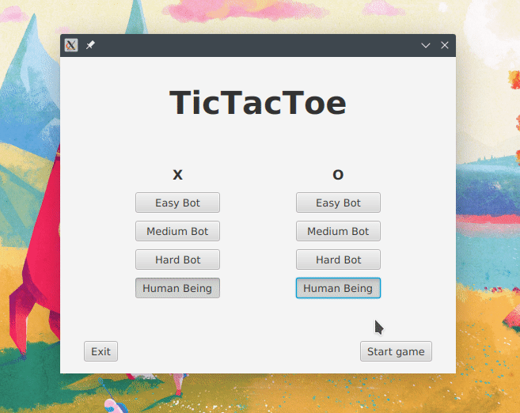

# Jogo da Velha com IA e interface gráfica
 [Esse projeto](https://github.com/raulalvesre/Jogo-da-Velha-com-IA) com interface gráfica.
 
 
 
 
 
#### Coisas que precisam melhorar
* Nomenclaturas
* Divisão de responsabilidade da classe "TicTacToe", atualmente ela faz coisas demais